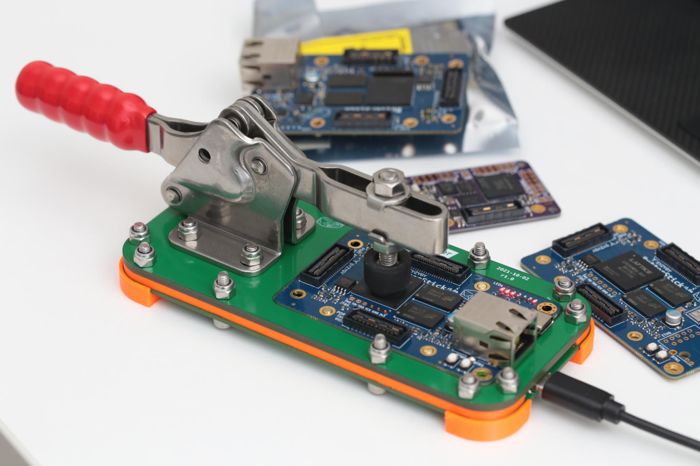

# ButterStick Programming-jig

A simple FT232H based programming jig for the ButterStick.

---

## What is it

A simple jig made from PCBs that connects to a ButterStick with pogo-pins.

The board supports 
 - Programming/comms over JTAG.
 - Voltage sensing via an SPI ADC connected to the FT232H's I/O pins.

## Render

